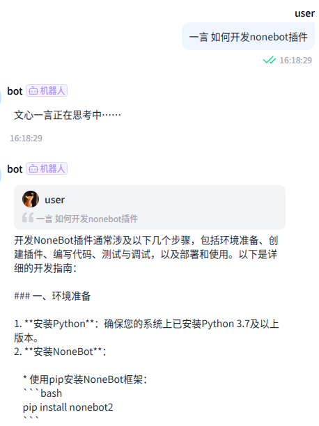

  
   
  

# nonebot-plugin-ernie

_✨ 简单的文心一言 AI 对话插件 ✨_

## 📖 介绍  

- 本插件使用千帆ModelBuilder的推理服务 API进行对话请求。推理服务 API分为V1和V2两个互不兼容的版本，使用前请根据希望使用的版本进行配置。
- V1版本使用前需根据[API调用指南](https://cloud.baidu.com/doc/WENXINWORKSHOP/s/dlv4pct3s)创建一个千帆应用以获取API Key、Secret Key。
- 使用前需根据[认证鉴权指南](https://cloud.baidu.com/doc/WENXINWORKSHOP/s/Um2wxbaps)创建一个千帆应用以获取API Key、AppID。  
- 支持的API列表：[V1](https://cloud.baidu.com/doc/WENXINWORKSHOP/s/om5aq2brc)、[V2](https://cloud.baidu.com/doc/WENXINWORKSHOP/s/em4tsqo3v)，默认为`ernie-4.0-turbo-8k`（V1和V2版本均可使用此模型）。

## 💿 安装

使用 nb-cli 安装（推荐）

在 nonebot2 项目的根目录下打开命令行, 输入以下指令即可安装

    nb plugin install nonebot-plugin-ernie

使用包管理器安装

在 nonebot2 项目的插件目录下, 打开命令行, 根据你使用的包管理器, 输入相应的安装命令

pip

    pip install nonebot-plugin-ernie

pdm

    pdm add nonebot-plugin-ernie

poetry

    poetry add nonebot-plugin-ernie

conda

    conda install nonebot-plugin-ernie

打开 nonebot2 项目根目录下的 `pyproject.toml` 文件, 在 `[tool.nonebot]` 部分追加写入

    plugins = ["nonebot_plugin_example"]

手动安装

    
    git clone https://github.com/Noctulus/nonebot-plugin-ernie.git
下载完成后在bot项目的pyproject.toml文件手动添加插件：

    plugin_dirs = ["xxxxxx","xxxxxx",......,"下载完成的插件路径/nonebot-plugin-ernie"]

## ⚙️ 配置

根据选择的API版本，在 nonebot2 项目的`.env`文件中添加下表中的必填配置

| 配置项 | 必填 | 默认值 | 说明 |
|:-----:|:----:|:----:|:----:|
| wenxin_api_type | 否 | V1 | 为了向前兼容性默认使用V1<del>（真的有其他人在用这个插件吗？）</del> |
| wenxin_ak | V1是 | 无 | 推理服务API V1的API Key |
| wenxin_sk | V1是 | 无 | 推理服务API V1的Secret Key |
| wenxin_api_key | V2是 | 无 | 推理服务API V2的API Key |
| wenxin_appid | V2是 | 无 | V2版本应用ID |
| wenxin_model | 否 | ernie-4.0-turbo-8k | 百度智能云千帆模型 |
| wenxin_sendpic | 否 | False | 是否以图片形式发送 |
| wenxin_timeout | 否 | 60 | 调用API多久无反应视为超时 |

> Note: 若调用`Deepseek R1`等大型模型，60秒以上的响应时间都是有可能的，请适当增加`wenxin_timeout`，并坐和放宽

## 🎉 使用
### 指令表
| 指令 | 权限 | 需要@ | 范围 | 说明 |
|:-----:|:----:|:----:|:----:|:----:|
| 一言 | 全部 | 否 | 全部 | 使用文心一言 API 进行对话生成 |
| 绘图 | 全部 | 否 |全部 | 使用文心一言 API 进行文生图作画 |
> Note: V1版本虽然支持部分文生图API，但经实测文审过于严格几乎处于不可用状态，故绘图仅支持在V2版本下使用。

### 效果图

- 如果配置了以图片形式发送（`wenxin_sendpic=True`），可以将Markdown形式的回答以更易读的方式呈现：
